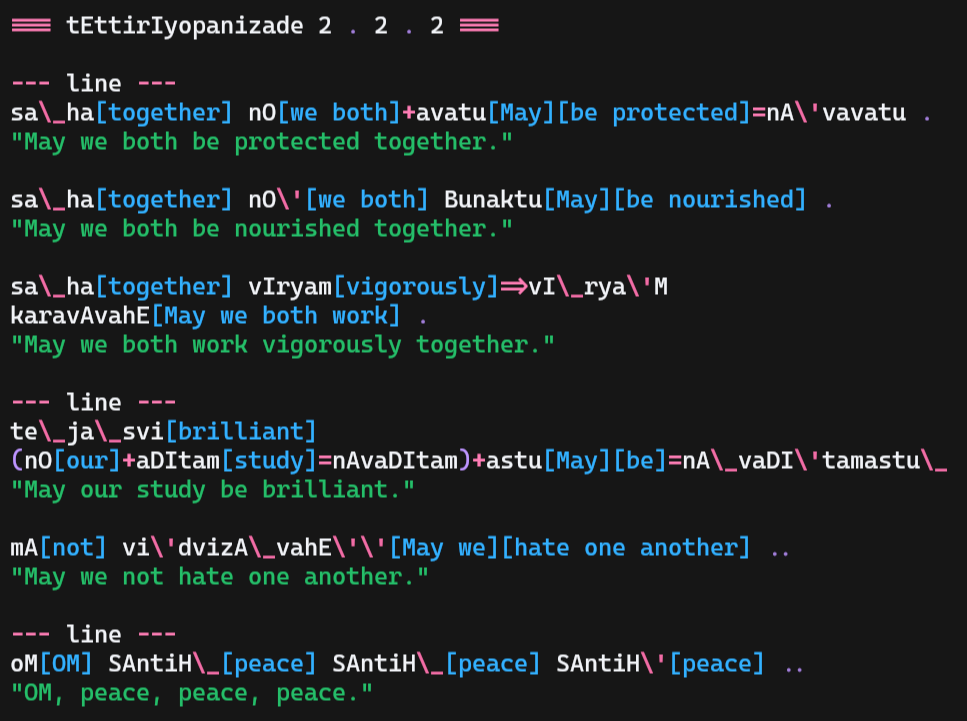

# nirukta [ निरुक्त ]

Nirukta is one of the ancient vedangas, or limbs of the vedas.
It is primarily focused on explaining words and their meanings- glossaries.
I do not know if the Sanskrit scholars of ancient India included basic vocabulary in such glossaries,
but all Sanskrit feels esoteric to a modern Westerner like myself.

Therefore I've created this tool to help visualize some of the more esoteric aspects of Sanskrit word decomposition that
readers might not otherwise notice for themselves in standard translations.

Each video is made with whatever version this software was on at the time of the video's production. For the most up to date functionality,
view the most recent video or the demo below.

https://github.com/user-attachments/assets/87a35900-abc8-4738-b6fd-220ca1c3b815

## videos:

1. [For the Benefit of Others](https://recursivepaws.dev/post/for-the-benefit-of-others)
2. ["Where can I find God?"](https://recursivepaws.dev/post/where-can-i-find-god)

